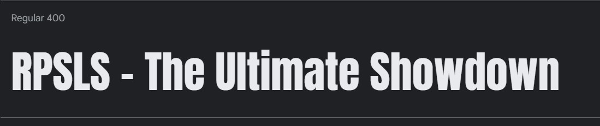

# RPSLS - The Ultimate Showdown

[View the live project here.](https://deanburke.github.io/RPSLS-TUS/)

Welcome to RPSLS - The Ultimate Showdown, the premiew online destination for all things Rock-Paper-Scissors-Lizard-Spock. Our website is dedicated to the classic hand gesture game that has entertained millions around the world.

With easy-to-use rules, RPSLS offers a fresh take on the game you love! So what are you waiting for? Join us now for the ultimate showdown!

---

# User Experience (US)

This website is designed to get the user as quick into the game as possible. With the rules visibly at and to cater to anyone new to this game made popular by the hit tv show 'The Big Bang Theory'.

# Design

## Wireframes

Wireframes were created for the site with  [Wireframe.cc](https://wireframe.cc/)

Wireframes were done for both a desktop view and mobile view.

## Colour Scheme

Neutral colours were chosen when considering the color palette to keep it user friendly on firs impressions.

Colour palette was created using:

* [Colormind](http://colormind.io/)

 

 ## Typography

 Anton was chosen from [Google Fonts](https://fonts.google.com/), this was with idea of imitating the Impact font on 'The Big Bang Theory' logo.

  

   

# Features

## Favicon

A favicon was implented with the logo used for the website, this was created with [Favicon.io](https://favicon.io/)

  

## Header with logo

Featured at the top page, the name of the website along with a logo, that rotates on load up. 

  

 

## Game Area

* Featured at the center of the page to direct user's attention to the game on entry to the website
* All buttons labeled with corresponding hand gesture, along with icons of said gestures obtained through [Font Awesome!](https://fontawesome.com/)

  

* Each button was given styling to let the user know which button they were hovering over. Along with a change of color when the user select the hand they are going to play that round. 

  

 

## Game Information Area

The game information area is located just beneath the game itself. Which itself has multiple features. 

* Located on the left and center is the user's current score and life count. 

  

* Located on the right is the rules button, which deploys a pop up model of all the information the user need to understand and get straight into some games.

  
  

 

## Gameplay

* The game starts as soon as the user selects their first hand gesture, the computer will then randomly choose their selection and a winner is determined.
* If the user wins, they will get an alert notification on their victory (along with letting you know what the computer's choice was) and the score will increase by 1, as pictured below. 

  

  

* If the user loses, they will get an alert notification of their loss (along with letting you know what the computer's choice was) and the user's life count will decrease by one, as pictured below. 

  

  

* If the user and the computer select the same hand gesture then the result of the round is a draw and you go again!

  

* Like everything, you're luck must run out at some point! When the user's life count hits zero, they will get an alert informing them and encouragement to try again and beat their score!

  

 

## Footer

*  The footer of the website is designed to be minimalistic and includes a clickable link for my LinkedIn page under 'Dean Burke'.

  

## Future Features
 
 * High score counter
 * Computer AI - If the user continues to choose the same hand gesture(or chooses it 4 times out of 5 etc), the computer recognizes this and will adjust their move.

  

 # Testing

 There was a number of different tests done to ensure that the website was working as it should:

* The website was tested on a number of different browsers:
    * Windows
        * Firefox on Windows 10 Pro
        * Chrome on Windows 10 Pro
    * Android
        * Chrome OnePlus 10
        * Chrome Samsung Galaxy S22
    * Apple iOS
        * Safari iPhone SE
* All features were tested as they were implemented such as spinning logo, pop out modal for rules section and then as each part of the game itself was created in JavaScript.
* Once I had worked on the responsiveness of the website the layout of both pages were tested in Google Dev Tools, on a 26 inch laptop screen, on a Samsung Galaxy Tab S8 (11 inch display) and on a OnePlus 10.
* I used both [W3C Validator](https://validator.w3.org/#validate_by_input) and [Jigsaw Validator](https://jigsaw.w3.org/css-validator/#validate_by_input) to test my code to check for mistakes or errors.
* I used lighthouse to improve accessibility and perfomance.
* I used [JSHint](https://jshint.com/) to check my JavaScript code and to check for warnings or game breaking errors.

 

## Bugs

**Solved Bugs**

* When deploying my website, I realized the spinning logo was not showing, resulting in the ALT text displaying.
  * When looking at my code in my index.html file it was incorrectly showing the below.
  
    
  * I had incorrectly place a slash at the start so it wasn't reading the directory on GitHub.
* When testing my code on [W3C Validator](https://validator.w3.org/#validate_by_input), I realized I had incorrectly play `
` tags inside of my `<i>` 
  * I adjuested this throughout my code in the Game Area, and then subsequently adjusted all the relevant CSS code.
* When initially creating my answers object in JavaScript code, as seen below.

  

  * I incorrectly forgot to place commas, after each individual errors, thus incurring errors when I got further into my coding fo the game.

**Unfixed Bugs**

No unfixed bugs.

